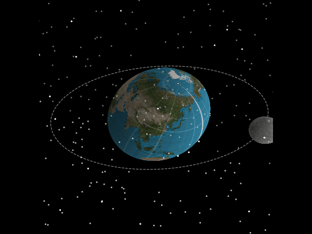

# Globe
Small python 3 project written as a stepping stone for my other repo [Solar_System](https://github.com/Shellywell123/Solar_System). Aims of rendering and animating the rotation and orbit of planets using matplotlib.



### How to setup:
In terminal/cmd prompt, clone the repository into you desired location:
```bash
foo@bar:~$ git clone https://github.com/Shellywell123/Globe.git
```

### How to run:
In terminal/cmd prompt, execute 'main.py' with python 3:
```bash
foo@bar:~$ python3 main.py
```

### Current Issues being worked on
 - location selector wont plot over rendered sphere
 - orientations not linked to correcet calander yet
 - not elliptial orbits
 - background stars are not of same seed