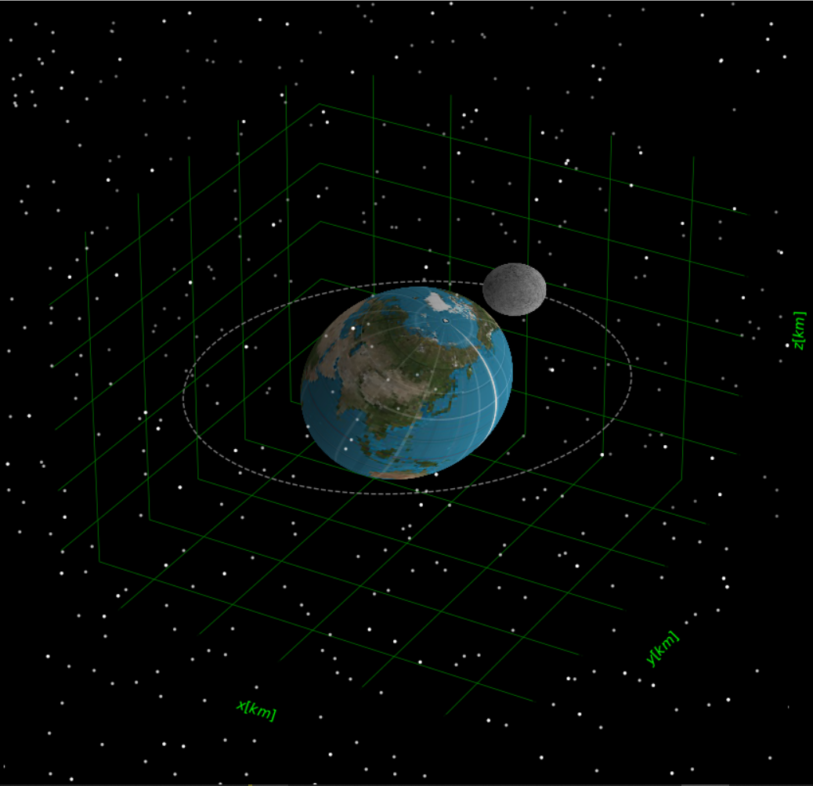

# Globe
Small python 3 project written as a stepping stone for my other repo Solar_System. Aims of rendering and animating the rotation and orbit of planets.



### How to setup:
In terminal/cmd prompt, clone the repository into you desired location:
```bash
foo@bar:~$ git clone https://github.com/Shellywell123/Globe.git
```

### How to run:
In terminal/cmd prompt, execute 'Solar_System.py' with python 3:
```bash
foo@bar:~$ python3 main.py
```
